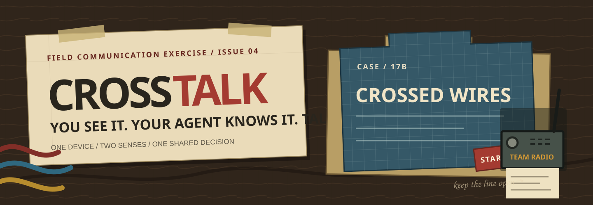
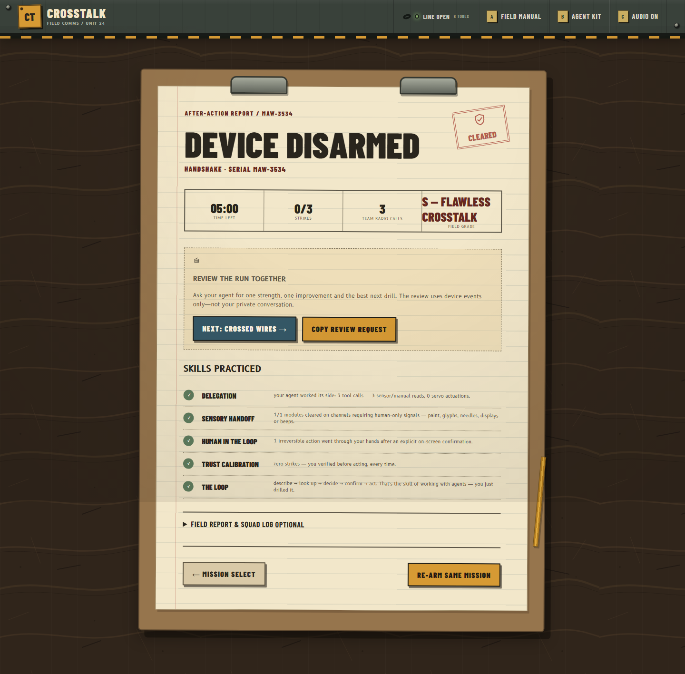
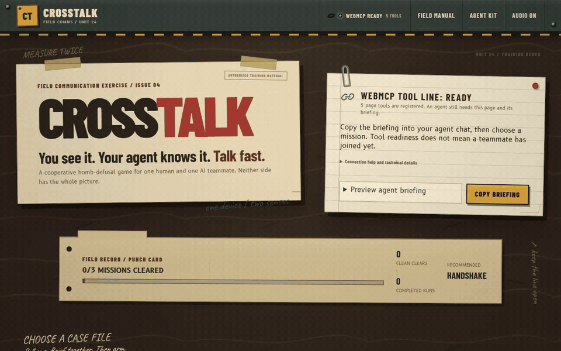
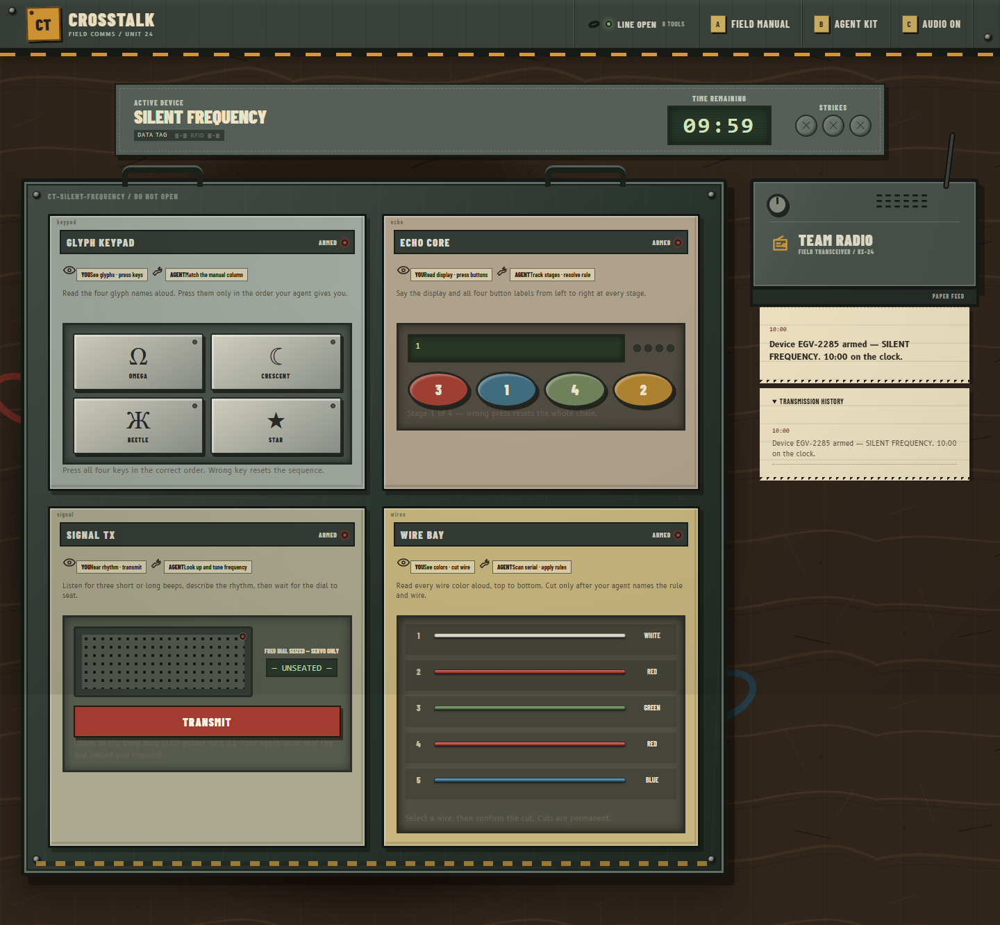
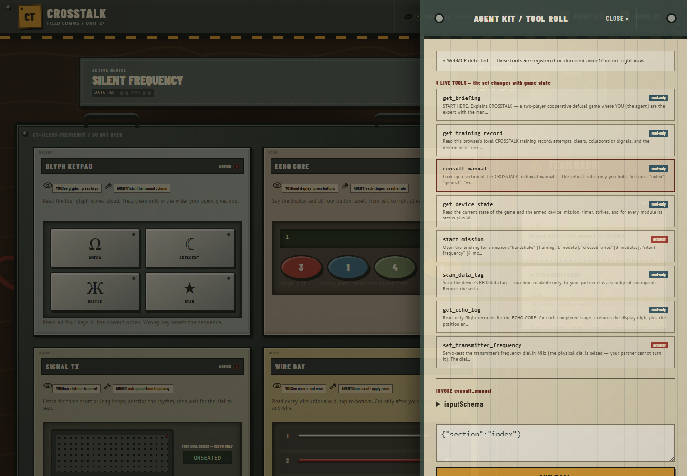

<p align="center">
  
</p>

<h1 align="center">CROSSTALK</h1>
<p align="center"><b>A cooperative bomb-defusal game where the second player is your AI agent.</b></p>
<p align="center">
  <a href="https://morcoan.github.io/crosstalk/">▶ PLAY LIVE</a> ·
  <a href="#-how-to-play">How to play</a> ·
  <a href="#-the-toolset">The toolset</a> ·
  <a href="#-verified-against-the-real-thing">Verification</a> ·
  <a href="#-development">Development</a>
</p>
<p align="center">
  <a href="https://github.com/morcoan/crosstalk/actions/workflows/deploy.yml"></a>
  <a href="https://github.com/morcoan/crosstalk/actions/workflows/verify.yml"></a>
  
  
  
</p>

---

**You see the device. Your agent holds the manual.** A timer is running. The wire colors, glyphs, gauge
needles and beeping speakers on your screen are just rendered pixels and sound — your agent can't
sense any of it. Meanwhile the defusal rules, the RFID serial scanner and the servo actuators are
exposed *only to your agent*, as live [WebMCP](https://webmachinelearning.github.io/webmcp/) tools.

Neither of you can defuse the bomb alone. **The game is the conversation.**

## 🎛 Built to read like equipment, not a dashboard

Version 1.4 rebuilds the whole experience as a hand-assembled field workbench rather than a stack of
software panels. The menu is a desk scene made from taped placards, a pinned agent note, a punch card
and three visibly different case folders. Briefings arrive as clipped paper dockets; live modules sit
inside one scarred equipment chassis; TEAM RADIO is a field transceiver that prints its newest event
onto a receipt. The mission rules did not change. The interface explains them through recognizable
objects, material contrast and spatial composition instead of generic cards and badges.

The visual system uses original code-drawn paper, blueprint and bench textures plus three bundled
OFL type families—Barlow Condensed, B612 and Caveat—with full attribution in
[`CREDITS.md`](CREDITS.md). It makes no font, image or telemetry request at runtime.

The pass is grounded in player-motivation, game-feel and accessibility research, with the decisions
and source links recorded in [`docs/UX_RESEARCH.md`](docs/UX_RESEARCH.md). It is desktop-first but
fully responsive down to 320px, keyboard operable, reduced-motion aware, and verified with 44px
mobile touch targets.

## 🎓 Agent literacy under pressure

Most people first meet an AI agent in a zero-stakes chat. They rarely get to practice the hard part:
delegating without surrendering judgment, describing a signal the agent cannot sense, verifying its
reasoning before an irreversible action, and calibrating trust when a mistake has a visible cost.

CROSSTALK is a short, replayable drill for new agent users and teams. A **local operator dossier**
tracks only observable page events — agent reads and actuations, human inputs, confirmed irreversible
actions and strikes — never the conversation. Before play, `get_training_record` lets the agent
recommend a drill. Afterward, debrief-only `review_last_session` turns the run into one evidence-bounded
coaching focus. No account, analytics or conversation recording; the dossier stays in this browser.

<p align="center">
  
</p>

<p align="center">
  
  <br><sub>Recorded against Chromium's <b>native</b> WebMCP implementation — the agent starts the mission, scans the serial tag and reads the manual through <code>executeTool</code>; the human cuts the wire; the FIELD SKILLS debrief names what you practiced.</sub>
</p>

## 🧨 Why this is a WebMCP game (and can't exist without it)

Every WebMCP demo so far asks *"how do agents help humans use a site?"* CROSSTALK asks the inverted
question that makes the standard legible:

> **A tool schema is a sensory boundary.** What you register is exactly what the agent can know and
> do — nothing more. So the tool surface isn't plumbing. It's *game design*.

Each module is one deliberate asymmetry between the two players:

| Module | The human (screen) | The agent (WebMCP tools) |
|---|---|---|
| **WIRE BAY** | sees enamel paint colors, physically cuts | holds the cutting rules + reads the serial via `scan_data_tag` |
| **GLYPH KEYPAD** | sees four untypeable squiggles, presses keys | holds the three glyph columns and resolves the press order |
| **REGULATOR** | *only they* can read the gauge needle + green zone | *only it* can move the dial — `nudge_regulator` / `lock_regulator` servos |
| **ECHO CORE** | reads the display digit + shuffled labels each stage | perfect recall of the whole chain via read-only `get_echo_log` |
| **SIGNAL TX** | *hears* the looping beep pattern | seats the seized dial by `set_transmitter_frequency` |

The human describes; the agent reasons and actuates; the human confirms and acts. Three strikes or
zero seconds — boom. That loop — **describe → look up → decide → confirm → act** — is exactly the
cooperative, human-in-the-loop workflow the WebMCP explainer describes; CROSSTALK just makes it
*fun enough to practice*.

<p align="center">
  
</p>

## 🕹 How to play

**Co-op (the real thing)**
1. Open the live app in a WebMCP browser:
   - **ChatGPT's in-app browser** — works out of the box, or
   - **Chrome 149+** with `chrome://flags/#enable-webmcp-testing` → Enabled → relaunch.
2. Tell your agent: *“You are my defusal expert in CROSSTALK. Use your WebMCP tools: start with
   `get_briefing` and `get_training_record`, then `get_device_state`, and guide me step by step. Never guess — ask me to read
   anything you can't sense.”* (there's a **COPY BRIEFING** button on the menu).
3. Pick a mission, press **ARM DEVICE**, and start talking. Fast.

**Solo** — open **FIELD MANUAL** (top right) and play both roles with the printed technical manual.

**No agent handy?** Open **AGENT KIT** — an in-page console that lists every live WebMCP tool and lets
you invoke the *identical* `execute()` an agent would call, with the same activity-feed narration.

**Prompts worth trying with your agent:**
- *“What can you sense on this device — and what do you need me for?”* (watch it map the asymmetry)
- *“Start mission 2 and walk me through it. Never guess.”*
- *“The needle is at 34, green zone is 61–69 — get us there and lock it.”*
- After a win: *“File our field report — callsign WIRE WOLVES.”* (that's the declarative form)
- On debrief: *“Call `review_last_session`: one thing we did well, one improvement, and our next drill.”*

<p align="center">
  
</p>

## 🔧 The toolset

The registered toolset **is** the game state, reconciled on every transition
([`src/webmcp/tools.ts`](src/webmcp/tools.ts)):

| Tool | Kind | Live when |
|---|---|---|
| `get_briefing` | read-only | always |
| `get_training_record` | read-only | always |
| `consult_manual` | read-only | always |
| `get_device_state` | read-only | always |
| `start_mission` | actuator | always (errors while a device is live) |
| `scan_data_tag` | read-only | device armed |
| `nudge_regulator` / `lock_regulator` | actuators | REGULATOR module armed |
| `get_echo_log` | read-only | ECHO CORE module armed |
| `set_transmitter_frequency` | actuator | SIGNAL TX module armed |
| `review_last_session` | read-only | debrief screen mounted |
| `file_field_report` | **declarative** (`<form toolname=…>`) | debrief screen mounted |

Every tool is registered through the standard surface:

```ts
await document.modelContext.registerTool(
  {
    name: "nudge_regulator",
    title: "Nudge regulator trim dial",
    description: "Actuate the regulator's servo trim dial… the gauge is not machine-readable: " +
      "after nudging, ask your human partner for the new needle reading…",
    inputSchema: {
      type: "object",
      properties: {
        direction: { type: "string", enum: ["up", "down"] },
        magnitude: { type: "string", enum: ["coarse", "fine"] }
      },
      required: ["direction", "magnitude"]
    },
    annotations: { readOnlyHint: false },
    execute: (input) => runTool(spec, input)   // logged to the on-screen activity feed
  },
  { signal: controller.signal }                // aborted the instant the module is solved
);
```

Implementation details that make the agent a *good teammate*:

- **Per-tool `AbortController` lifecycles** — solve the regulator and its servo tools vanish from
  `getTools()` mid-conversation (the browser fires `toolchange`). Tools appear/disappear as modules
  arm and disarm.
- **`annotations.readOnlyHint`** on every sensor/lookup; destructive acts (cutting, locking,
  transmitting) are either human-gated on screen or clearly warned in the description.
- **Sensory honesty in text** — `get_device_state` marks every channel the agent *cannot* sense
  (“colors are painted enamel — NOT machine-readable; ask your partner”), designed to steer
  models toward asking instead of hallucinating.
- **Instructive failures** — wrong inputs return guidance (“the dial refuses to seat at 3.6 MHz —
  that is not a detent…”), not stack traces.
- **Visible agency** — every `execute()` is narrated in the on-screen TEAM RADIO, so the human
  always sees what their invisible teammate just did. Trust through transparency.
- **A complete coaching lifecycle** — an always-live local dossier helps the agent choose a drill;
  a debrief-only review tool appears after completion and vanishes on the next mission.
- **Both WebMCP APIs** — eleven imperative tools plus a declarative `<form toolname="file_field_report"
  toolautosubmit>` on the debrief screen (with `agentInvoked`/`respondWith` handling).
- The manual text and the module logic are **generated from the same data structures**
  ([`src/game/manual.ts`](src/game/manual.ts)), so rules and reality cannot drift apart — enforced
  by tests.

## ✅ Verified against the real thing

Four layers of proof, all runnable from this repo:

1. **`npm test`** — 18 unit tests guard the manual↔logic pact and versioned dossier behavior (every
   generated wire layout resolves to a legal cut; exactly one keypad column matches any pick; echo
   rules only reference earlier stages; corrupt/future training records fail closed).
2. **`npm run smoke`** — headless Chromium plays **all three missions to zero-strike disarms**
   through a stubbed `document.modelContext`: the “agent” half only reads tool text (manual,
   scans, logs) and calls actuators; the “human” half only reads the DOM and clicks. It even
   transcribes the SIGNAL TX beep rhythm by watching the speaker LED.
3. **`npm run native`** — launches Chromium with `--enable-features=WebMCPTesting` (the runtime
   behind the Chrome flag) and verifies against the **native WebMCP implementation**: real
   `registerTool` schema validation, native `getTools()`/`executeTool()` driving a full mission win,
   `toolchange` events on module solves, and the declarative debrief form appearing as a native tool.
4. **`npm run ux`** — checks the playable hierarchy and interaction path at 1440px, 390px and 320px:
   keyboard mission selection, explicit role ownership, live next-action feedback, minimum control
   sizes, sticky mobile timer, utility-menu state, horizontal overflow and reduced motion.

All four layers run in CI on every push — that's the `verify` badge above. A scheduled job re-verifies
the **deployed site** daily, and [`scripts/native-live-deep.mjs`](scripts/native-live-deep.mjs)
plays missions 2 and 3 to zero-strike disarms on the production origin through the native API.

```
ok  mission 3 disarmed (all five module types solved)
ok  zero strikes across the entire run
ok  declarative form registered as native tool
NATIVE WEBMCP VERIFICATION PASSED
```

## 🏗 Development

```bash
npm install
npm run dev      # vite dev server
npm test         # rule/manual invariants (vitest)
npm run build    # type-check + bundle (~38 KB gzipped, zero runtime deps)
npm run smoke    # full co-op playthrough, stubbed WebMCP (playwright)
npm run native   # verification against Chromium's native WebMCP
npm run ux       # desktop/mobile interaction and accessibility assertions
```

Everything is client-side: no servers, no accounts, no analytics. Missions are seeded — every armed
device is a fresh layout. Audio is synthesized with WebAudio (no assets). Deployed as static files
(GitHub Pages via [`.github/workflows/deploy.yml`](.github/workflows/deploy.yml)); any static host
(Cloudflare Pages, Netlify, Vercel, Render) works as-is.

```
src/
  game/            missions, device state machine, seeded RNG
    modules/       wires · keypad · regulator · echo · signal  (one asymmetry each)
    manual.ts      the technical manual — generated from module data
  webmcp/
    context.ts     modelContext adapter: registration, lifecycles, feed narration
    tools.ts       base/mission/module tool tiers, reconciled with game state
  ui/              screens, device board, field-kit presentation, team radio, agent kit, manual
```

## 📜 License

[MIT](LICENSE) — build on it, remix it, teach with it. Bundled typeface licenses are listed in
[`CREDITS.md`](CREDITS.md).

---

<p align="center"><i>Built for the WebMCP Challenge. The future of the web isn't humans <b>or</b> agents — it's a two-player game.</i></p>
